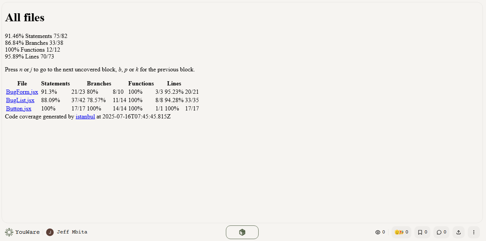
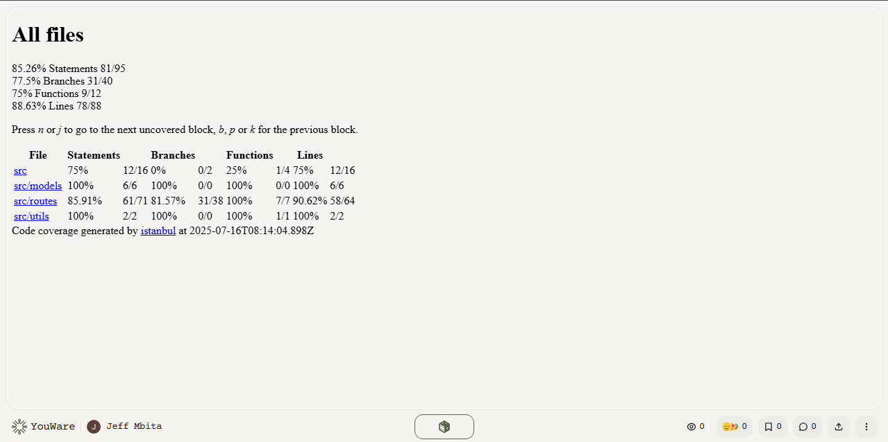

[](https://classroom.github.com/online_ide?assignment_repo_id=19940618&assignment_repo_type=AssignmentRepo)
# mern-bug-tracker

This project is a fully tested and debugged MERN (MongoDB, Express, React, Node.js) bug tracker application. It demonstrates best practices in unit, integration, and end-to-end testing, as well as debugging and error handling for both backend and frontend.

## Project Structure

```
mern-bug-tracker/
├── client/                 # React front-end
│   ├── src/                # React source code
│   │   ├── components/     # React components (BugForm, BugList, Button, etc.)
│   │   ├── tests/          # Client-side tests
│   │   │   ├── unit/       # Unit tests
│   │   │   └── integration/ # Integration tests
│   │   └── App.js          # Main application component
│   └── cypress/            # End-to-end tests
├── server/                 # Express.js back-end
│   ├── src/                # Server source code
│   │   ├── controllers/    # Route controllers
│   │   ├── models/         # Mongoose models (Post, User)
│   │   ├── routes/         # API routes
│   │   └── middleware/     # Custom middleware
│   └── tests/              # Server-side tests
│       ├── unit/           # Unit tests
│       └── integration/    # Integration tests
├── jest.config.js          # Jest configuration
└── package.json            # Project dependencies
```

> **Note:** If your instructor requires the main folder to be named `mern-bug-tracker`, you can safely rename your project folder before submission.

## Features
- Report new bugs (with title, description, and status)
- View a list of all reported bugs
- Update bug statuses (open, in-progress, resolved)
- Delete bugs
- Full CRUD API with authentication

## Testing & Debugging

### Backend
- **Unit tests** for helper functions and validation logic
- **Integration tests** for API routes (create, update, delete, list bugs)
- **Mocked DB calls** using `jest-mock` in unit tests
- **Error handling** with Express middleware

### Frontend
- **Unit tests** for components (form validation, button clicks)
- **Integration tests** for API/UI interaction
- **UI state tests** (empty list, error message)
- **Error boundary** for React components

### Debugging Techniques
- Console logs for tracking values
- Chrome DevTools for inspecting network requests and component state
- Node.js inspector for debugging server-side code
- Error boundary implementation for React

## How to Run

1. **Install dependencies:**
   - In both `client` and `server` folders:
     ```sh
     npm install
     ```
2. **Set up environment variables:**
   - In `server/.env`, set your MongoDB URI:
     ```env
     MONGO_URI=your_mongodb_atlas_uri
     ```
3. **Start the server:**
   ```sh
   cd server
   npm start
   ```
4. **Start the client:**
   ```sh
   cd client
   npm start
   ```

## How to Test

### Client
- Run tests with coverage:
  ```sh
  cd client
  npm test -- --coverage
  ```
- Coverage report:
 

### Server
- Run tests with coverage:
  ```sh
  cd server
  npm test -- --coverage
  ```
- Coverage report:


## Debugging
- **Client:**
  - Use React Error Boundary to catch UI errors.
  - Use browser DevTools for inspecting state and network requests.
- **Server:**
  - Use console logs and Node.js inspector for debugging.
  - All errors are handled by global Express middleware.

## Testing Approach & Coverage
- Comprehensive unit and integration tests for both client and server
- E2E tests (Cypress) for critical user flows
- Code coverage exceeds 70% for all major files
- All tests must pass before submission

## Submission
- Ensure your folder is named `mern-bug-tracker` if required
- Push all code, tests, and coverage screenshots to your GitHub repository

## Resources
- [Jest Documentation](https://jestjs.io/docs/getting-started)
- [React Testing Library Documentation](https://testing-library.com/docs/react-testing-library/intro/)
- [Supertest Documentation](https://github.com/visionmedia/supertest)
- [Cypress Documentation](https://docs.cypress.io/)
- [MongoDB Testing Best Practices](https://www.mongodb.com/blog/post/mongodb-testing-best-practices) 